[frontend](https://github.com/Tryd0g0lik/book_shop_frontend)
Репозиторий представлен для усиления резюме, но сама разработка продолжается. Код сырой но читабельный

На момент публикации мжно посмотреть 
- project
- persones
- downloads
- catalog
- __tests__

### КЕЙС: "Разработка интернет-магазина с нуля (проект на продажу)"

---

#### 1. Регистрация и верификация пользователя

**Бизнес-задача:**
Создать безопасную регистрацию пользователей с подтверждением email, чтобы исключить ботов и гарантировать валидность контактов для будущих маркетинговых рассылок.
Особо стал востребован с 2025-2026 годами :) в связи с новыми законами от Госдумы РФ.

**Техническое решение:**
- Внедрил **django-allauth** — готовый модуль для сохранения возможности масштабирования сервиса. то есть сразу заложил архитектуру для соц-сетей без переписывания кода в будущем.
- Реализация модуля была разделенной между frontend/backend — теперь она доступна всем участников проекта независимо друг от друга (если владелец займётся разработкой или тестированием).
- Реализация согласий на обработку данных. 
- Реализовал **6-значный цифровой код подтверждения** (без сложных ссылок, чтоб избежать потери клиента на этапе регистрации). Максимум это пользователь покидает сайт, чтоб войти в свою почту. 
- Настроил эмуляцию почтового сервера — письма выводятся в консоль (для этапа разработки), а продакшн-настройки (SMTP) подключаются путём изменения флага DEBUG. В планах выбрать постовое провайдера и получить данные для подключения.

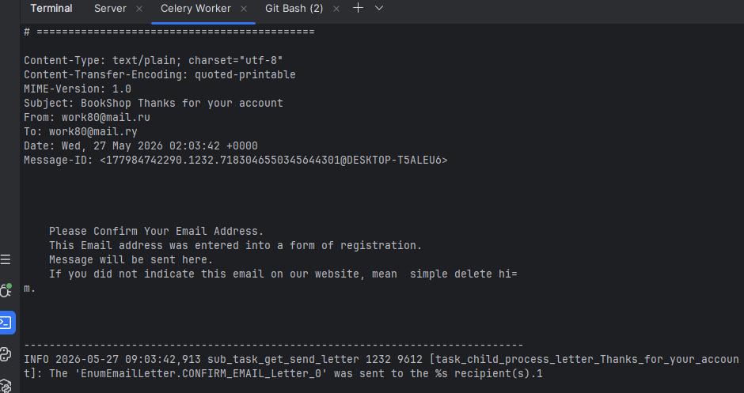

**Результат:**
- Регистрация работает без сбоев, код верификации живет строго **5 минут** (безопасность).
- Готовый фундамент для соц-авторизации — расширение займет часа 4 (в первый но с внешними API & токенами работал не раз ). Потолок думаю день, не неделю. Хотя потолок для такого кода часа 2. 
- **В планах:** восстановление пароля по той же логике.

**Формы**

|*Форма регистрации*||*Форма для секретного кода*||*Форма входа*|
|:----|:----|:----|:----|:----|
|[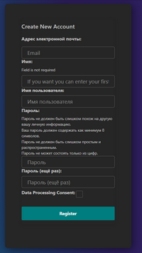](img/register_form_large.png)||[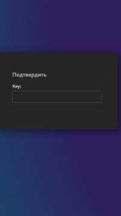](img/verification_form_large.png)||[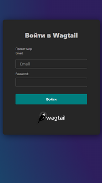](img/login_form_large.png)|
|Сделайте клик||Сделайте клик||Сделайте клик|

---

#### 2. Авторизация и безопасность

**Бизнес-задача:**
Защитить пользовательские данные и сессии, не перегружая базу данных лишними запросами.

**Техническое решение:**
- Написал **кастомную логику авторизации** с хешированием паролей (django-bcrypt/стандартный PBKDF2).
- Внедрил **Celery + Redis** — кеширование сессий и временных данных, чтобы PostgreSQL не дергалась при каждом действии пользователя (снижение нагрузки на БД).
- Отключу кеш для критических операций (финансовые данные), оставив для "быстрых" запросов.

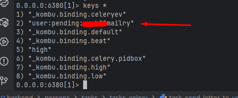

**Результат:**
- Время ответа страницы сократилось за счет кеширования.
- База данных не страдает от тысяч одновременных проверок авторизации.

---

#### 3. Массовая загрузка товаров из XLS-файла (Самый сильный кейс!)

**Бизнес-задача:**
Позволить менеджеру загрузить прайс-лист с 10 000+ товаров за 1 минуту, а не вбивать вручную. При этом защитить сервер от "тяжелых" файлов и потери данных из-за ошибок в файле.

**Техническое решение:**
- **Чанковая загрузка (chunks):** файл режется на части прямо при загрузке, чтобы не положить сервер (ограничение по весу для каждого временного файла).
- **Временное хранилище:** использовал библиотеку `tempfile` — файлы сохраняются в `media/temp/chunked_uploads`, а затем собираются в единый `media/documents`.
- **Механизм "отказоустойчивости":** если при записи в БД происходит ошибка (например, кривой формат ячейки), проблемные данные не теряются, а записываются в отдельный **лог-файл с ограничением по размеру и привязкой к имени продукта** (чтобы не забить диск). Если ошибок много и/или модератор давно не заглядывал в логи, то файлы копятся.

[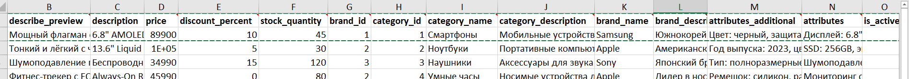](img/file_xsl_small.png)

**Результат:**
- Менеджер загружает каталог за секунды вместо дней ручного ввода (сделай клик).\
[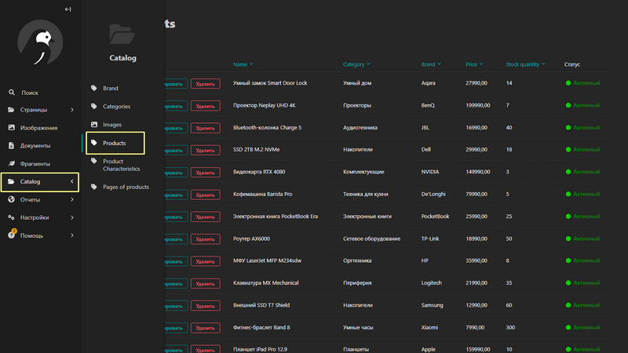](img/catalog.png) \
Сделай клик.

*Note*: Имея предпочтение (или возникших 1-ой или 2-х позиций) менеджер может забить товар в ручном исполнении.

---
#### 4. Характеристики товара в двух исполнениях
Позволить менеджерам создавать характеристики разных типов/
**Note**: О многоязычности ниже. 

||||
|:---|:---|:---|
|[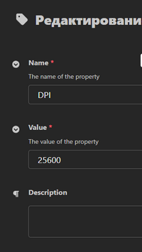](img/characteristics_form_large.png)|[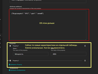](img/characteristics_form_large_2.png)|[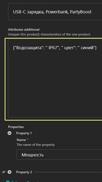](img/characteristics_form_large_3.png)|
|сделайте клик|сделайте клик|Уникальная характеристика товара|
*Уникальная характеристика товара* - когда имеем характеристику где больше не встречаем. Менеджер может просто добавить ее в форматах:
- "`{"Водозащита": " IP67"}`"\
or
- "`"Водозащита"="IP67"`. 
При сохранении преобразуется в JSON.

- Сервер не падает даже при заливке файлов на 100+ МБ.
- При ошибке — администратор получает файл с проблемными строками и может их исправить.

**В планах**
- Создать - операцию по откатке (транзакции), чтобы не было "половинчатых" данных. Хотя это дело предпочтения уже владельца.

---

#### 5. Работа с фронтендом и адаптация шаблонов

**Бизнес-задача:**
Админка (Wagtail) должна выглядеть современно.

**Техническое решение:**
- Адаптировал стандартные (и проолжаю адаптировать) шаблоны Wagtail под дизайн-систему, внедрил **кастомный JS** для динамических элементов. Усливаю админку инфографикой.
- Связал фронт с бэкенд-логикой в админке Wagtail. 

**Результат:**
- Администратор получает UI, не уступающий современным SaaS-панелям.
- Код шаблонов отделен от бизнес-логики — легко менять дизайн.

**В планах**
- Усилить админку (Wagtail) AJAX & fetch, чтоб избежать усталости глаз от перезагрузки страниц. 

---

#### 6. Контроль качества кода

**Бизнес-задача:**
Избежать "технического дефолта" — чтобы через месяцы и годы код можно было расширять, а не переписывать.

**Техническое решение:**
- Настроил **автоматический запуск линтеров** (Flake8/Black/isort/EsLint) при коммите через **pre-commit hooks**.
- Код автоформатируется под единый стандарт перед git-комитами. Автоматически, просто надо создать текст для комита

**Результат:**
- Весь проект написан в едином стиле — в команде (владельца) не будет споров о форматировании.
- Быстро находить ошибки, потому что код (мне кажется) читается как книга.

||||
|:----|:----|:----|
|[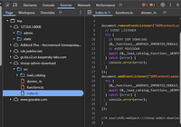](img/devtools.png)||[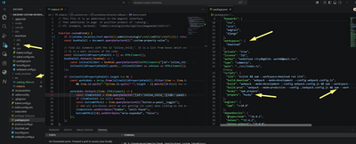](img/workspaces.png)|
|Сделайте клик||Сделайте клик|

---

#### 6. Многоязычночть интерфейса.
**Бизнес-задача:**
Нанимать персонал без привязки к стране.

**Техническое решение:**
- Сейчас настройка на трех языках: RU / EN / FR. Афто перевод интерфейса в зависимости от языка браузера.

**В плане:**
Конечная цель – сделать авто-перевод контента по предпочтению модератора - просто заполнив дополнительные поля (Заголовок, описание товара, ...). 

## 7. Таблица прав доступа (матрица)

| Действие                                              | BASE | CLIENT | MANAGER             | MODERATOR | ADMIN| EDITOR |
|-------------------------------------------------------|------|--------|---------------------|-----------|-------------------------|--------|
| **==  Аккаунт**                                       |||||||
| Регистрация                                           |✅    |❌|❌|❌|❌|❌|
| Создать аккаунт клиента                               |❌|✅(только собственник⚠️)|✅|✅|✅|❌|
 | *войти в собственный аккаунт*                         |❌|✅|✅|✅|✅|✅|
 | *войти в аккаунт ( не являющий собственным ) клиента* |❌|❌|✅|✅|✅|❌|
| Видеть личные данные в аккаунте (собственника)        |❌|✅(только собственник⚠️)|✅|✅|✅|✅(только собственник⚠️)|
| Изменить email в аккаунте                             |❌|❌|❌|❌|✅|❌|
| Изменить личные данные в аккаунте                     |❌|✅(только собственник⚠️)|✅(только собственник⚠️)|✅|✅|✅(только собственник⚠️)|
| Удалить аккаунт ( не являющий собственным )           |❌|❌|❌|❌|✅|❌|
| Удаление аккаунта                                     | ❌    |✅ (только собственник⚠️)|✅(только собственник⚠️)|✅(только собственник⚠️)|✅ |✅(только собственник⚠️)|
| Подтверждение email (до авторизации)                  |✅| ❌| ❌| ❌| ❌|❌|
| Авторизация (email)                                   |❌ |✅      |✅|✅    |✅    |✅    |
| Авторизация (MAX)                                     |❌ |✅      |✅|✅    |✅    ✅    |
| Выход из аккаунта                                     |❌ |✅      |✅|✅    |✅    |✅    |
| Изменение личных данных (кроме email)                 | ❌    |✅(только собственник⚠️)|✅(только собственник⚠️)|✅    | ✅|✅(только собственник⚠️)|
| Просмотр истории покупок собственника аккаунта        | ❌    |✅ (только собственник⚠️)|✅(всех кроме MODERATOR & ADMIN) |✅ |✅|✅(только собственник⚠️)|
| Удаление строки из собственника истории               |❌      |❌|❌    |✅|✅|❌|
| Удаление всех строк собственника истории              |❌|❌|❌|✅ |✅|❌|
| Удаление строки из общей  истории                     |❌|❌|❌|✅ |✅|❌|
| Удаление всех строк из общей истории                  | ❌|❌|❌|✅|✅|❌|
| **==  Каталог**                                       |||||||
| Просмотр каталога (до авторизации)                    |✅    |✅      |✅|✅    |✅ |✅ |
| Просмотр товара (до авторизации)                      |✅    |✅      |✅|✅    |✅ |✅ |
| Создать позицию товар (после авторизации)             | ❌    |❌      |✅|✅    |✅ |✅ |
| Изменить позицию товар (после авторизации)            | ❌    |❌      |✅|✅    |✅ |✅ |
| Удалить позицию товар (после авторизации)             | ❌    |❌      |✅|✅    |✅ |✅ |
| Наполнение корзины (до авторизации)                   |✅(только собственник⚠️)|✅(только собственник⚠️)|✅(только собственник⚠️)|✅(только собственник⚠️)|✅(только собственник⚠️)|✅(только собственник⚠️)|
| Наполнение корзины (после авторизации)                | ❌    |✅(только собственник⚠️)|✅(только собственник⚠️)|✅(только собственник⚠️)|✅(только собственник⚠️)|✅(только собственник⚠️)|
| Оплата корзины (до авторизации)                       | ❌    | ❌      | ❌| ❌    |❌ |❌ |
| Оплата корзины (после авторизации)                    | ❌    |✅(только собственник⚠️)|✅(только собственник⚠️)|✅(только собственник⚠️)|✅(только собственник⚠️)|✅(только собственник⚠️)|
| Удачная одна транзакция                               | ❌    |✅(только собственник⚠️)|✅|✅    |✅ |✅(только собственник⚠️)|
| Список удачных транзакций                             | ❌    |✅(только собственник⚠️)|✅|✅    |✅ |✅(только собственник⚠️)|
| Неудачная одна транзакция                             | ❌    |✅(только собственник⚠️)|✅|✅    |✅ |✅(только собственник⚠️)|
| Список неудачных транзакций                           | ❌    |✅(только собственник⚠️)|✅|✅    |✅ |✅(только собственник⚠️)|
| **== Контент сайта**                                  |||||||
| Видеть контент                                        |✅|✅|✅|✅|✅|✅|
| Создать контент                                       |❌|❌|❌|✅|✅|✅|
| Изменить контент                                      |❌|❌|❌|✅|✅|✅|
| Удалить контент                                       |❌|❌|❌|✅|✅|✅|
| **==  Загрузка XSL файла**                            |||||||
| Загрузить файл до авторизации                         |❌|❌|❌|❌|❌|❌|
| Загрузить файл                                        |❌|❌|✅|✅|✅|❌|

✅ разрешено,  
❌ запрещено
