Все работы проводятся в сихронном рехиме так работаю с проектом - один: 
- Тут [меняю базовую Wagtile admin панель](https://github.com/Tryd0g0lik/book_shop_frontend). 
- Frontend - работаю над UI.
- `Koa`/Node - [базовый сервер](https://github.com/Tryd0g0lik/book_shop_koa_server) для работ по разработке UI. 

Евляется личным проектом. Репозиторий представлен для усиления резюме, но сама разработка продолжается.\
Дерево проэкта представлено не полностью. Код сырой, но читабельный

На момент публикации мжно посмотреть 
- project
- persones
- downloads
- catalog
- __tests__

### КЕЙС: "Разработка интернет-магазина с нуля (проект на продажу)"

---

#### 1. Регистрация и верификация пользователя

**Бизнес-задача:**
Создать безопасную регистрацию пользователей с подтверждением email, чтобы исключить ботов и гарантировать валидность контактов для будущих маркетинговых рассылок.
Особо стал востребован с 2025-2026 годами :) в связи с новыми законами от Госдумы РФ.

**Техническое решение:**
- Внедрил **django-allauth** — модуль для возможности масштабирования сервиса. Например для авторизации через соцсети( без переписывания кода в будущем).
- Реализация согласий на обработку данных. 
- Реализовал **6-значный цифровой код подтверждения** (без сложных ссылок, чтоб избежать потери клиента на этапе регистрации). Максимум это пользователь покидает сайт, чтоб войти в свою почту.

|*view from the console*||*view from the Email's Server*|
|:-----:|:-----:|:-----:|
|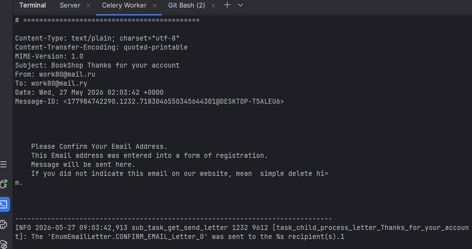||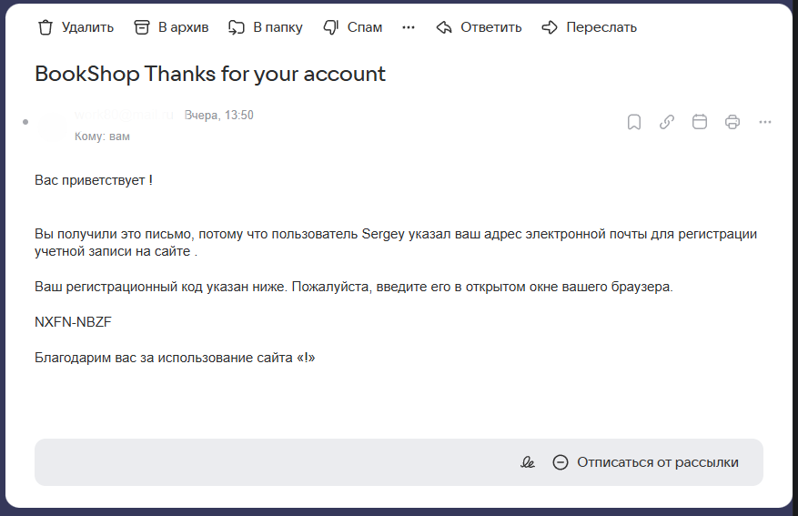|


**Результат:**
- Регистрация работает без сбоев, код верификации живет строго **5 минут** (безопасность).
- Готовый фундамент для соц-авторизации — расширение займет часа 4 (в первый но с внешними API & токенами работал не раз ). Потолок думаю день, не неделю. Хотя потолок для такого кода часа 2. 
- **В планах:** восстановление пароля по той же логике.

**Формы**

|*Форма регистрации*||*Форма для секретного кода*||*Форма входа*|
|:----|:----|:----|:----|:----|
|[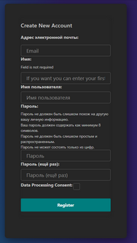](img/register_form_large.png)||[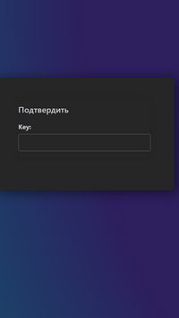](img/verification_form_large.png)||[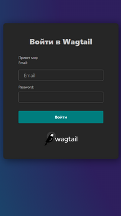](img/login_form_large.png)|
|Сделайте клик||Сделайте клик||Сделайте клик|

---

#### 2. Авторизация и безопасность

**Бизнес-задача:**
Защитить пользовательские данные и сессии, не перегружая базу данных лишними запросами.

**Техническое решение:**
- Написал **кастомную логику авторизации** с хешированием паролей (django-bcrypt/стандартный PBKDF2).
- Внедрил **Celery + Redis** — кеширование сессий и временных данных, чтобы PostgreSQL не дергалась при каждом действии пользователя (снижение нагрузки на БД).
- Отключу кеш для критических операций (финансовые данные), оставив для "быстрых" запросов.

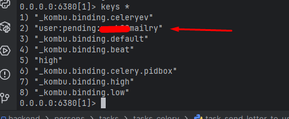

**Результат:**
- Время ответа страницы сократилось за счет кеширования.
- База данных не страдает от тысяч одновременных проверок авторизации.

---

#### 3. Массовая загрузка товаров из XLS-файла (Самый сильный кейс!)

**Бизнес-задача:**
Позволить менеджеру загрузить прайс-лист с 10 000+ товаров за 1 минуту, а не вбивать вручную. При этом защитить сервер от "тяжелых" файлов и потери данных из-за ошибок в файле.

**Техническое решение:**
- **Чанковая загрузка (chunks):** файл режется на части прямо при загрузке, чтобы не положить сервер (ограничение по весу для каждого временного файла).
- **Временное хранилище:** использовал библиотеку `tempfile` — файлы сохраняются в `media/temp/chunked_uploads`, а затем собираются в единый `media/documents`.
- **Механизм "отказоустойчивости":** если при записи в БД происходит ошибка (например, кривой формат ячейки), проблемные данные не теряются, а записываются в отдельный **лог-файл с ограничением по размеру и привязкой к имени продукта** (чтобы не забить диск). Если ошибок много и/или модератор давно не заглядывал в логи, то файлы копятся.

[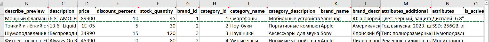](img/file_xsl_small.png)

**Результат:**
- Менеджер загружает каталог за секунды вместо дней ручного ввода (сделай клик).\
[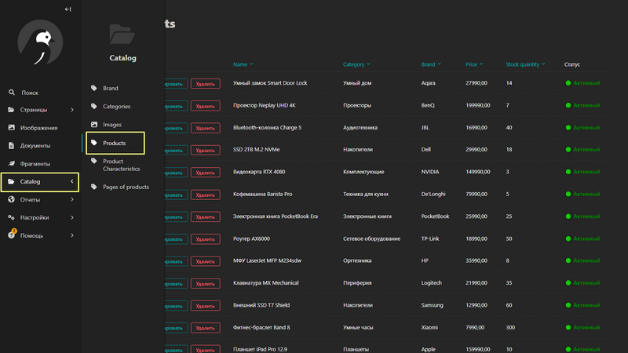](img/catalog.png) \
Сделай клик.

*Note*: Имея предпочтение (или возникших 1-ой или 2-х позиций) менеджер может забить товар в ручном исполнении.

---
#### 4. Изображение товара

|                                                                                                                         |||
|:------------------------------------------------------------------------------------------------------------------------|:---|:---|
| 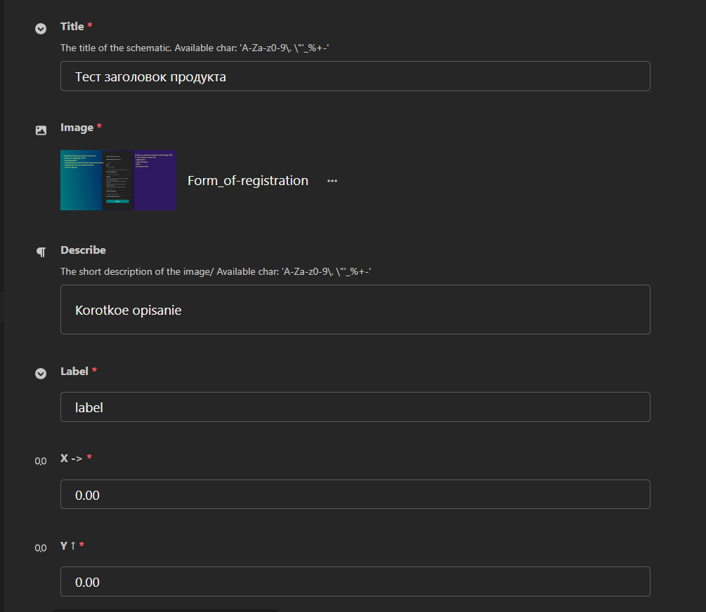 |||
|                                                                                                                         |||

---
#### 5. Характеристики товара в двух исполнениях
Позволить менеджерам создавать характеристики разных типов/
**Note**: О многоязычности ниже. 

|                                                                                                                                                                   |                                                                                                                                                          |                                                                                                                                                   |
|:------------------------------------------------------------------------------------------------------------------------------------------------------------------|:---------------------------------------------------------------------------------------------------------------------------------------------------------|:--------------------------------------------------------------------------------------------------------------------------------------------------|
| [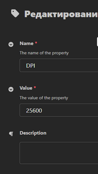](img/characteristics_form_large.png)                      | [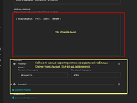](img/characteristics_form_large_2.png) | [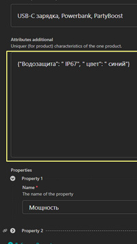](img/characteristics_form_large_3.png) |
| сделайте клик                                                                                                                                                     | сделайте клик                                                                                                                                            | Уникальная характеристика товара                                                                                                                  |
*Уникальная характеристика товара* - когда имеем характеристику где больше не встречаем. Менеджер может просто добавить ее в форматах:
- "`{"Водозащита": " IP67"}`"\
or
- "`"Водозащита"="IP67"`. 
При сохранении преобразуется в JSON.


- Сервер не падает даже при заливке файлов на 100+ МБ.
- При ошибке — администратор получает файл с проблемными строками и может их исправить.

**В планах**
- Создать - операцию по откатке (транзакции), чтобы не было "половинчатых" данных. Хотя это дело предпочтения уже владельца.


---


#### 6. Работа с фронтендом и адаптация шаблонов

**Бизнес-задача:**
Админка (Wagtail) должна выглядеть современно.

**Техническое решение:**
- Адаптировал стандартные (и проолжаю адаптировать) шаблоны Wagtail под дизайн-систему, внедрил **кастомный JS** для динамических элементов. Усливаю админку инфографикой.
- Связал фронт с бэкенд-логикой в админке Wagtail. 

**Результат:**
- Администратор получает UI, не уступающий современным SaaS-панелям.
- Код шаблонов отделен от бизнес-логики — легко менять дизайн.

**В планах**
- Усилить админку (Wagtail) AJAX & fetch, чтоб избежать усталости глаз от перезагрузки страниц. 

---

#### 7. Контроль качества кода

**Бизнес-задача:**
Избежать "технического дефолта" — чтобы через месяцы и годы код можно было расширять, а не переписывать.

**Техническое решение:**
- Настроил **автоматический запуск линтеров** (Flake8/Black/isort/EsLint) при коммите через **pre-commit hooks**.
- Код автоформатируется под единый стандарт перед git-комитами. Автоматически, просто надо создать текст для комита

**Результат:**
- Весь проект написан в едином стиле — в команде (владельца) не будет споров о форматировании.
- Быстро находить ошибки, потому что код (мне кажется) читается как книга.

||||
|:----|:----|:----|
|[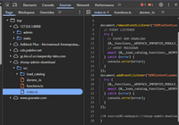](img/devtools.png)||[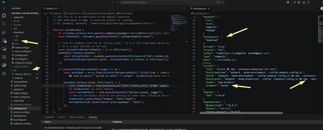](img/workspaces.png)|
|Сделайте клик||Сделайте клик|


Возможно получит одно изображение и/или несколько в карусели

---

#### 8. Многоязычность интерфейса.
**Бизнес-задача:**
Нанимать персонал без привязки к стране.

**Техническое решение:**
- Сейчас настройка на трех языках: RU / EN / FR. Авто перевод интерфейса в зависимости от языка браузера.

**В плане:**
Конечная цель – сделать авто-перевод контента по предпочтению модератора - просто заполнив дополнительные поля (Заголовок, описание товара, ...). 

## 8 Permissions
Каждое приложение имеет 6 (максимум 7) ролей: ADMIN, MODERATOR, and more.\
Для каждой роли в каждом приложении создан свой список правил и прав. 

Каждый роль (исключая "BASE") имеет (назовём это) ГРУБЬЫЕ и ТОНКИЕ  права ("permissions") доступа.
Чтоб новые (более тонкие) правила ролей не смешивать в одной общей Django's ленте таблицы "`auth_permission`", правила разделены на две группы.\

**ГРУБЬЫЕ** права например из приложения "`profiles`"
Note: "`profiles`" - это приложение в которой также регулируется права пользователя в правила пользователя.

- из "`profiles/models/models_admin.py`" например "`MODERATORS`" согласно правилу "`can_view_list_of_profiles`"\
могут просматривать список из профилей.

**ТОНКИЕ** права:
- файл из "`profiles/permissions/permission_checker.py`" для "`MODERATORS`" согласно правилу "`can_view_list_of_profiles`" \
сообщит, что "`MODERATORS`" не имеет права просматривать профиль из списка с ролью "`ADMIN`".

### 8.0. Роли 
Note: В коде используются как категория статуса или просто категория.
```text
("BASE", "Base"),
("ADMIN", "Admin"),
("MANAGER", "Manager"),
("CLIENT", "Client"),
("MODERATORS", "Moderators"),
("EDITORS", "Editors"),
```

### 8.1. Таблица прав доступа (матрица)


| Действие                                                     | BASE | CLIENT | MANAGER                         | MODERATOR | ADMIN| EDITOR |
|--------------------------------------------------------------|------|--------|---------------------------------|-----------|-------------------------|--------|
| **==  Аккаунт**                                              |||                                 ||||
| Регистрация                                                  |✅|❌| ❌                               |❌|❌|❌|
| Создать аккаунт клиента                                      |❌|✅(только собственник⚠️)| ✅                               |✅|✅|❌|
| *войти в собственный аккаунт*                                |❌|✅| ✅                               |✅|✅|✅|
| *войти в аккаунт под логином и паролем клиента*              |❌|❌| ❌                               |❌|✅|❌|
| *Изменить пароль аккаунта*                                   |❌|✅(только собственник⚠️)| ✅(только собственник⚠️)         |✅(только собственник⚠️)|✅|✅(только собственник⚠️)|
| *Изменить собственный пароль клиента*                        |❌|❌| ❌                               |❌|✅|❌|
| Удалить аккаунт ( не являющий собственным )                  |❌|❌| ❌                               |❌|✅|❌|
| Удалить аккаунт                                              |❌|✅(только собственник⚠️)| ✅(только собственник⚠️)         |✅(только собственник⚠️)|✅|✅(только собственник⚠️)|
| Подтверждение email (до авторизации)                         |✅|❌| ❌                               |❌|❌|❌|
| Авторизация (email)                                          |❌|✅| ✅                               |✅|✅|✅|
| Авторизация (MAX)                                            |❌|✅| ✅                               |✅|✅✅|
| Выход из аккаунта                                            |❌|✅| ✅                               |✅|✅|✅|
|                                                              |||                                 ||||
| **==  Профиль данные**                                       |||                                 ||||
| Видеть личные данные из профильной страницы (собственника)   |❌|✅(только собственник⚠️)| ✅                               |✅|✅|✅(только собственник⚠️)|
| Изменение личных данных из профильной страницы (кроме email) |❌|✅(только собственник⚠️)| ✅(только собственник⚠️)         |✅| ✅|✅(только собственник⚠️)|
| Изменить email в профиле                                     |❌|❌| ❌                               |✅|✅|❌|
| Изменить наименование профиля                                |❌|❌| ❌                               |❌|✅|❌|
| Создать наименование профиля                                 |❌|❌| ❌                               |❌|❌|❌|
| Удалить наименование профиля                                 |❌|❌| ❌                               |❌|❌|❌|
|                                                              |||                                 ||||
| **==  Каталог & позиция товара**                             |||                                 ||||
| Просмотр каталога                                            |✅|✅| ✅                               |✅|✅|✅|
| Просмотр товара                                              |✅|✅| ✅                               |✅|✅|✅|
| Создать позицию товара (после авторизации)                   |❌|❌| ✅                               |✅|✅|✅|
| Создать позиции товара через загрузку XSL файла              |❌|❌| ✅                               |✅|✅|✅|
| Изменить позицию товара (после авторизации)                  |❌|❌| ✅                               |✅|✅|✅|
| Удалить позицию товар (деактивировать)                       |❌|❌| ✅                               |✅|✅|✅|
| Удалить позицию товара (если автор)                          |❌|❌| ✅(только автор⚠️)               |✅|✅|✅(только автор⚠️)|
| Удалить весь товар (деактивировать)                          |❌|❌| ❌                               |❌|✅|❌|
| **== История каталога**                                      |||                                 ||||
| Просмотр истории каталога                                    |❌|❌| ✅|✅|✅|✅|
| Удалить историю каталога                                     |❌|❌| ❌|✅|✅|❌|
| Изменить историю каталога                                    |❌|❌| ❌|❌|❌|❌|
| Добавить в историю каталога                                  |❌|❌| ❌|❌|❌|❌|
|                                                              |||                                 ||||
| **==  Корзина**                                              |||                                 ||||
| Наполнение корзины (после авторизации)                       |❌|✅(только собственник⚠️)| ✅(только собственник⚠️)         |✅(только собственник⚠️)|✅(только собственник⚠️)|✅(только собственник⚠️)|
| Изменить состав корзины (до авторизации)                     |✅(только собственник⚠️)|✅(только собственник⚠️)| ✅(только собственник⚠️)         |✅(только собственник⚠️)|✅(только собственник⚠️)|✅(только собственник⚠️)|
| Изменить состав корзины (после авторизации)                  |❌|✅(только собственник⚠️)| ✅(только собственник⚠️)         |✅(только собственник⚠️)|✅(только собственник⚠️)|✅(только собственник⚠️)|
| Удалить состав корзины (до авторизации)                      |✅(только собственник⚠️)|✅(только собственник⚠️)| ✅(только собственник⚠️)         |✅(только собственник⚠️)|✅(только собственник⚠️)|✅(только собственник⚠️)|
| удалить состав корзины (после авторизации)                   |❌|✅(только собственник⚠️)| ✅                               |✅|✅|✅(только собственник⚠️)|
| Просмотр состава корзины (до авторизации)                    |✅(только собственник⚠️)|✅(только собственник⚠️)| ✅(только собственник⚠️)         |✅(только собственник⚠️)|✅(только собственник⚠️)|✅(только собственник⚠️)|
| Просмотр состава корзины (После авторизации)                 |✅(только собственник⚠️)|✅(только собственник⚠️)| ✅                               |✅|✅|✅(только собственник⚠️)|
|                                                              |||                                 ||||
| **==  Заказы**                                               |||                                 ||||
| Просмотр удачная одна транзакция                             |❌|✅(только собственник⚠️)| ✅                               |✅|✅|✅(только собственник⚠️)|
| Просмотр неудачная одна транзакция                           |❌|✅(только собственник⚠️)| ✅                               |✅|✅|✅(только собственник⚠️)|
| Просмотр общий список транзакций                             |❌|❌| ✅                               |✅|✅|❌|
| Удалить общий список транзакций                              |❌|❌| ✅                               |✅|✅|❌|
| Оплата корзины (до авторизации)                              |❌|❌ | ❌                               |❌|❌|❌|
| Оплата корзины (после авторизации)                           |❌|✅(только собственник⚠️)| ✅(только собственник⚠️)         |✅(только собственник⚠️)|✅(только собственник⚠️)|✅(только собственник⚠️)|
| Изменить объем заказа                                        |❌|❌ | ❌                               |❌|❌|❌|
| **== История заказов**                                       |||                                 ||||
| Просмотр истории покупок                                     |❌|✅(только собственник⚠️)| ✅(всех кроме MODERATOR & ADMIN) |✅|✅|✅(только собственник⚠️)|
| Удаление строк собственника истории                          |❌|✅(только собственник⚠️)| ✅(только собственник⚠️)         |✅(только собственник⚠️)|✅|✅(только собственник⚠️)|
| Удаление строки из общей  истории                            |❌|❌| ❌                               |✅|✅|❌|
|                                                              |||                                 ||||
| **== Контент сайта**                                         |||                                 ||||
| Видеть контент                                               |✅|✅| ✅                               |✅|✅|✅|
| Создать контент                                              |❌|❌| ❌                               |✅|✅|✅|
| Изменить контент                                             |❌|❌| ❌                               |✅|✅|✅|
| Удалить контент                                              |❌|❌| ❌                               |✅|✅|✅|


✅ разрешено,  
❌ запрещено
 ---
## API Map (first)

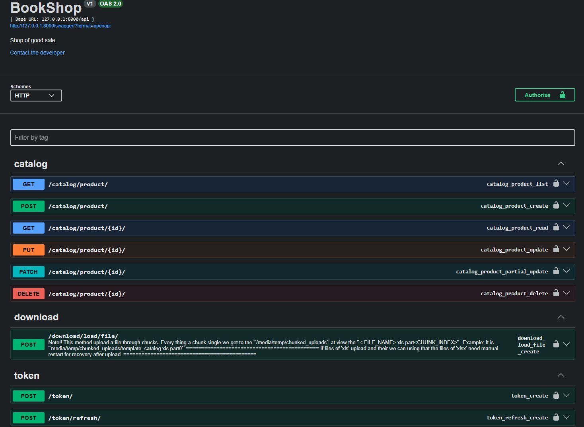

## .env

```.env
PYTHONPATH=< path_name_to_the_foot_folder_of_your_project > # The development mode 
PYTHONUNBUFFERED=1 # The development mode
PYTHONUTF8=1 # The development mode
PYCHARM_PROPERTIES=d:/Programs/Pyacharm/PyCharm 2025.1.3.1/bin < It_is_the_root_my_IDE&for_different_the_junks_It_is_relocate_from_the_C_disk>
SECRET_KEY_DJ=< The_secret_password_of_your_project >

# ============== APP
APP_NAME=BookShop # The name your servic 
APP_PROTOCOL=http # http
APP_HOST=127.0.0.1 
APP_PORT=8000
APP_TIME_ZONE=Asia/Krasnoyarsk

APP_MINIMUM_PASSWORD_LENGTH=7 # The min length of the password string
APP_MAX_PASSWORD_LENGTH=255 # The max length of the password string

# ============== DaTABASE
POSTGRES_USER= < the_your_name_of_user_db >
POSTGRES_HOST= < host_your_db >
POSTGRES_PORT= < port_your_db >
POSTGRES_PASSWORD=< the_password_of_user_db >
POSTGRES_DB= <The_name_of_the_your_db>

# ============== VIEW DATABAS & MORE
# "1" it is Yes/true & "0" it is not/false.
IS_DEBUG=1

DJANGO_ENV=development # Important!! THe mode (or environment) works for the your project 
## Тестирование
#DJANGO_ENV=testing
## Стейджнг
#DJANGO_ENV=staging
## Продакшен
#DJANGO_ENV=production

# ============== Redis
REDIS_URL=redis://< IP_your_redis >:< Port_your_redis >
REDIS_DB=< Number_your_redis-db >
REDIS_HOST=< IP_your_redis >
REDIS_PORT=< Port_your_redis >

# ============== Celery + Redis
REDIS_MASTER_NAME=<user_name_of_redis-db> # It is my login from the SSH for the connection to the my server
REDIS_PASSWORD= < password of_redis-db>  # It is my password from the SSH for the connection to the my server

# ============== EMAILING
# Letter
SUBJECT_CONFIRM_EMAIL_LETTER_0='Book SHOP - Your email address was added' # Simple message for user 
SUBJECT_KEY_PENDING_SECOND_1="Book SHOP - Code of verification"

# User Emeil
# Message about registration
USER_EMAIL_BASIS_MASSAGE='Check the your email and follow the link'
APP_EMAIL_HOST= < Your_email_server >
APP_EMAIL_PORT=< Port_from_the_Your_email_server >
# # https://docs.djangoproject.com/en/6.0/ref/settings/#default-from-email
APP_DEFAULT_FROM_EMAIL= < your@email.ru>
APP_EMAIL_HOST_PASSWORD=< Passwort_from_the_remote_app > # REading the document from your/on the email-server

# ============== JWT (minutes)
JWT_ACCESS_TOKEN_LIFETIME_MINUTES=20 # THe time life of your JWT-token
JWT_REFRESH_TOKEN_LIFETIME_DAYS=60 # THe time life of your JWT-token
JWT_SECRET_KEY= <sekret_key_for_encryption >
# ============== TEST
# PLAYWRIGHT TEST
# True - It is when we can not to see the browsser or False
HEADLESS_MODE=True

# ============== API OPTIONS
REST_FRAMEWORK_PAGINATION_SIZE=3 # It is how mach of lines from the db to the one page  

```

## Else files

- [README_orders.md](orders/README_orders.md)
- [README_person.md](persons/README_person.md)
- [README_profile.md](profiles/README_profile.md)
- [README.md](download/README.md)
- [README](persons/interfaces/README.md)


## Root tree

```text

book_shop
├── __tests__/
├── .pytest_cache/
├── caching/
├── cart/
├── catalog/
├── collectstatic/
├── content_pages/
├── download/
├── img/
├── media/
├── nginx/
├── orders/
├── persons/
├── profiles/
├── project/
├── static/
├── templates/
├── utilities/
├── .browserslistrc
├── .coverage
├── .dockerignore
├── .editorconfig
├── .env
├── .flake8
├── .gitignore
├── .pre-commit-config.yaml
├── .pylintrc
├── docker-compose.yml
├── Dockerfile
├── LICENSE.md
├── manage.py
├── pyproject.toml
├── pytest.ini
├── README.md
├── requirements.txt
```

