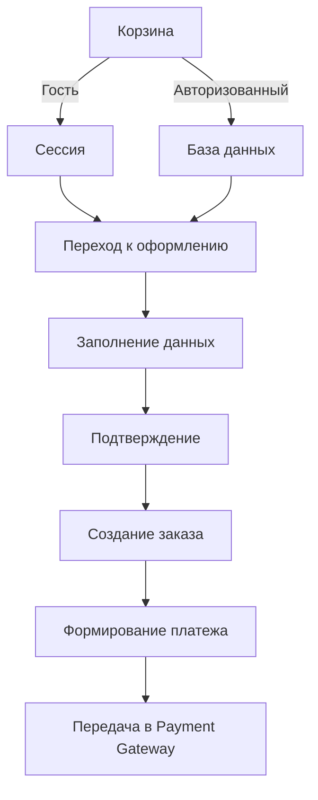
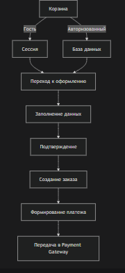

## Схема связей

```
┌─────────────────────────────────────────────────────────────────────────────┐
│                            СТРУКТУРА ЗАКАЗА                                │
├─────────────────────────────────────────────────────────────────────────────┤
│                                                                             │
│  ┌─────────────────────────────────────────────────────────────────────┐   │
│  │                          ORDER (Заказ)                              │   │
│  │  id, user, customer_email, customer_name                           │   │
│  │  subtotal, discount, shipping_cost, tax, total                     │   │
│  │  status, payment_method, payment_status, payment_id                │   │
│  │  shipping_address, tracking_number, delivery_company               │   │
│  │  created_at, updated_at, completed_at                              │   │
│  └─────────────────────────────────────────────────────────────────────┘   │
│                     │                  │                  │                │
│                     ▼                  ▼                  ▼                │
│  ┌──────────────────────────┐ ┌──────────────────────────┐ ┌────────────────┐│
│  │      ORDER_ITEM          │ │      PAYMENT            │ │   ORDER_LOG    ││
│  │  order, product          │ │  order, amount         │ │  order        ││
│  │  product_name, sku       │ │  method, status        │ │  old_status   ││
│  │  product_price           │ │  payment_id, provider  │ │  new_status   ││
│  │  quantity, options       │ │  card_last4            │ │  user         ││
│  │  subtotal, total         │ │  created_at, paid_at   │ │  comment      ││
│  └──────────────────────────┘ └──────────────────────────┘ └────────────────┘│
│                                                                             │
└─────────────────────────────────────────────────────────────────────────────┘
```

## Рекомендации

| Аспект | Рекомендация |
|--------|--------------|
| **Снэпшоты данных** | Сохраняйте цену и название товара на момент заказа (даже если товар потом изменится) |
| **История статусов** | Всегда логируйте изменения статуса (для отчетности и поддержки) |
| **Статусы заказа** | Используйте понятную иерархию статусов (от ожидания до доставки) |
| **Платежи** | Храните ответы платежной системы (для отладки и возвратов) |
| **Анонимные заказы** | Сохраняйте email для связи, даже если пользователь не авторизован |
| **Индексы** | Добавляйте индексы на часто фильтруемые поля (`user`, `status`, `created_at`) |

Эта структура дает вам полный контроль над заказами, позволяет отслеживать историю и легко расширять функциональность.


Отличный вопрос! Чтобы правильно спроектировать логику, нужно четко разделить **состояния** корзины и **этапы** оформления заказа. Вот полная пошаговая логика, от добавления товара до передачи данных в платежную систему.

### Общая схема (логика)



[](../img/shema_large.png)

---

### Шаг 0. Корзина (Cart)

**Суть:** Это временное хранилище выбранных товаров. Оно **не является** заказом.

- **Гость (неавторизованный):** корзина хранится в **сессии** браузера.
- **Авторизованный пользователь:** корзина хранится в **базе данных** (привязана к `profile_id`).

**Действия:**
- Добавление товара (увеличение количества).
- Изменение количества.
- Удаление товара.
- Очистка корзины.

**Важно:** На этом этапе мы **не спрашиваем** адрес, не рассчитываем скидки и не требуем оплаты. Это просто список товаров.

---

### Шаг 1. Переход к оформлению (Checkout)

**Суть:** Пользователь нажимает «Оформить заказ». Корзина переходит в состояние «оформления».

**Что происходит:**
1. Система **проверяет корзину**:
   - Не пуста ли она?
   - Все ли товары есть в наличии (доступное количество)?
   - Актуальны ли цены?
2. Если корзина «валидна», мы **передаем** её содержимое на следующую страницу.
3. Если есть проблемы (товара нет в наличии), мы **блокируем** переход и показываем сообщение об ошибке.

**Логика:** С этого момента корзина «замораживается» для редактирования (обычно это реализуется на уровне UI).

---

### Шаг 2. Заполнение данных о покупателе и доставке

**Суть:** Сбор информации, необходимой для формирования заказа.

**Что собираем:**
- **Email** (обязательно, даже для гостей).
- **Телефон**.
- **Имя** (для доставки).
- **Адрес доставки** (город, улица, дом, квартира).
- **Способ доставки** (почта, курьер, самовывоз).
- **Способ оплаты** (карта, PayPal, наличные и т.д.).

**Логика:**
- Для **авторизованных** пользователей можно **подставить** данные из профиля (но позволить их изменить).
- Для **гостей** — все поля пустые, обязательные к заполнению.

**Важно:** На этом этапе мы еще **не создаем** заказ в базе данных. Мы просто собираем данные в форме.

---

### Шаг 3. Проверка данных и расчет итогов (Summary)

**Суть:** Показ пользователю **итоговой информации** перед окончательным подтверждением.

**Что рассчитываем:**
- **Сумма товаров** (сумма цен × количество).
- **Скидка** (если есть).
- **Стоимость доставки**.
- **Итоговая сумма** к оплате.

**Что отображаем:**
- Список товаров с ценами.
- Выбранный способ доставки и оплаты.
- Адрес доставки.

**Логика:** Это **финальная проверка**. Пользователь видит все детали и может вернуться на предыдущий шаг, чтобы что-то изменить.

---

### Шаг 4. Создание заказа (Order Creation)

**Суть:** Пользователь нажимает «Подтвердить заказ». Мы фиксируем все данные.

**Критический момент:** Это **точка невозврата**.

**Что происходит:**
1. **Атомарная операция** в базе данных (транзакция):
   - Создается запись `Order` (заказ) со статусом `pending` (ожидает оплаты) или `created`.
   - Создаются записи `OrderItem` (позиции заказа) с **копией** цен, названий и опций товара.
   - Списание товара со склада (уменьшение `stock_quantity` или резервирование).
2. **Корзина очищается** (удаляется из сессии или БД).
3. **Генерируется уникальный ID заказа** (номер) для дальнейшего отслеживания.

**Логика:**
- Заказ существует **вне** корзины. Корзина уже не нужна.
- Если на этом этапе произойдет ошибка (например, не хватило товара), транзакция **откатывается**, и пользователь видит ошибку.

---

### Шаг 5. Формирование данных для платежа (Payment Data)

**Суть:** Создание набора данных, который будет передан в платежный шлюз (Payment Gateway) для фактического списания денег.

**Источники данных:**
- Из созданного заказа `Order` (сумма `total`, валюта, ID заказа).
- Из выбранного способа оплаты (например, `payment_method = 'card'`).
- Из данных пользователя (email, телефон, IP-адрес для антифрода).

**Что формируется:**
- **Сумма платежа** (`amount`).
- **Описание платежа** (например, "Заказ №12345").
- **Ссылка для возврата** (`return_url` — куда вернуть пользователя после оплаты).
- **Ссылка для уведомлений** (`webhook_url` — где принимать ответ от платежной системы).

**Логика:**
- Мы **не передаем** данные карты или пароли. Этим занимается платежная система.
- Мы передаем **идентификаторы** (ID заказа, сумма) и **контекст** (email, имя).

---

### Шаг 6. Передача в Payment Gateway

**Суть:** Мы передаем сформированные данные в платежную систему (например, YooKassa, Stripe, PayPal).

**Как это выглядит:**
- Пользователь перенаправляется на **страницу оплаты** платежной системы.
- Или платеж выполняется **через API** (если это позволяет система) с отображением iframe/виджета на вашем сайте.

**Логика:**
- Платежная система возвращает **временный идентификатор сессии платежа**.
- Мы сохраняем этот идентификатор в наш `Payment` или `Order` (поле `payment_id`).
- Платеж получает статус `pending` (ожидает).

---

### Шаг 7. Обработка результата платежа

**Суть:** Получение ответа от платежной системы.

**Варианты ответа:**
- **Успех (`success`):**
  - Статус заказа меняется на `paid` (оплачен).
  - Статус платежа меняется на `success`.
  - Сохраняется `payment_date` (дата оплаты).
  - Отправляется письмо клиенту о подтверждении заказа.
- **Ошибка (`failed`):**
  - Статус заказа остается `pending` или меняется на `failed`.
  - Мы показываем пользователю сообщение об ошибке.
- **Возврат (`refund`):**
  - Обрабатывается отдельно (пользователь инициирует возврат через поддержку).

---

### Итоговая логическая цепочка

1. **Корзина** → список товаров (сессия или БД).
2. **Оформление** → проверка корзины, переход к форме.
3. **Данные** → сбор адреса и способа оплаты.
4. **Итоги** → показ суммы и проверка данных.
5. **Подтверждение** → создание заказа (транзакция БД).
6. **Платеж** → формирование данных для оплаты.
7. **Передача** → отправка в платежную систему.
8. **Ожидание** → пользователь на странице оплаты.
9. **Результат** → обработка успеха или ошибки.

### Важные нюансы

- **Резервирование товаров:** На шаге 5 (создание заказа) лучше **резервировать** товары на складе. Если оплата не прошла, резерв нужно снять.
- **Повторные попытки:** Пользователь может закрыть страницу оплаты и вернуться. Заказ уже существует, мы можем предложить оплатить его снова.
- **Сессии для гостей:** Если гость оформил заказ, мы должны сохранить его email и данные, чтобы связаться с ним.
- **История статусов:** Все изменения статуса заказа (`pending` → `paid` → `processing` → ...) должны логироваться.
